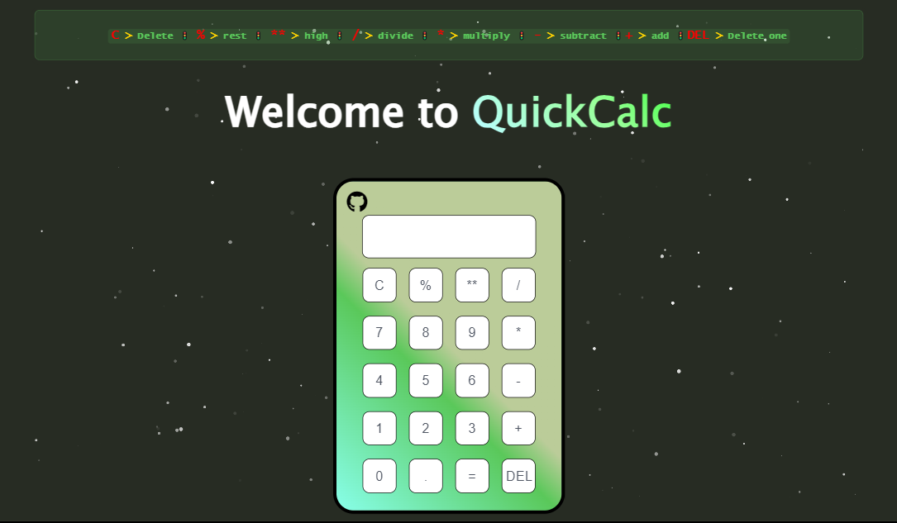

# ☕  QuickCalc

[](https://github.com/Ballwictb)

[](https://codespaces.new/withastro/astro?devcontainer_path=.devcontainer/basics/devcontainer.json)

> 🧑‍🚀 **Clumsy penguin?**



## 🚀 Project Structure

```text
/
├── public/
│   ├── icon
│   │   └── favicon-32x32.svg
│   └── image.png
├── src/
│   ├── components/
│   │   └── Calculator.astro
│   ├── css/
│   │   └── particles.css
│   │   └── style-calc.css
│   ├── js/
│   │   └── app.js
│   │   └── particles.min.js
│   │   └── scriptCalc.js
│   ├── layouts/
│   │   └── Layout.astro
│   └── pages/
│       └── index.astro
└── package.json
```

## 👀 Want to see more?

You can see it in my [profile](https://github.com/Ballwictb) or in [Ballcourses](https://www.ballcourses.com/).
